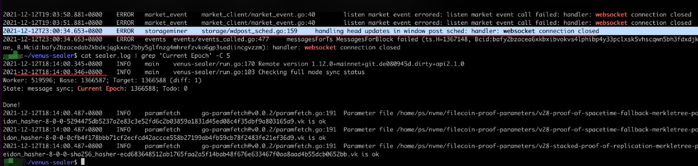

# Venus-Sealer

## Sealer 问题汇总：

* 近期遇到了一个问题，连续3天winpost（时空证明）没有验证通过，甚至DeclareFaultsRecovered的消息都没有发出来，第一天遇到这个问题的时候，重启了一次sealer，但是第二天依然如故，然后排查日志时怀疑是由于GPU被sectors C2占用导致时空证明无法完成，但是第三天依然如故，经过ops的仔细排查，最后发现由于websocket断开导致消息无法接收：


**处理方案:**&#x20;

现阶段只能通过重启sealer的方式来处理，希望venus增加重试机制

通过命令和日志查看和判断 websocket connection closed是否断开了；


##
